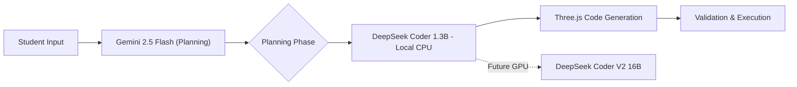

# Kusmus AI - STEM Sandbox Model Architecture & Strategy

**Document Version**: 1.0  
**Last Updated**: February 8, 2026  
**Status**: Strategic Roadmap

---

## Executive Summary

Kusmus AI's STEM Sandbox leverages a **hybrid AI architecture** that balances immediate performance with long-term strategic independence. Our current implementation uses best-in-class commercial APIs while maintaining a clear path to proprietary model ownership.

### Key Strategic Points
- ✅ **Current**: Groq API for high-speed code generation (70 tokens/sec, free tier)
- 🎯 **6-Month Goal**: Fine-tuned proprietary model based on DeepSeek Coder V2
- 🚀 **12-Month Goal**: Fully self-hosted AI infrastructure with custom physics-aware model

---

## Current Architecture (Phase 1: Hybrid Local + Cloud)

### Model Stack

| Component | Model | Purpose | Cost | Performance |
|-----------|-------|---------|------|-------------|
| **Planning (Sandbox)** | Gemini 2.5 Flash | State-of-the-art physics logic | $0.075/1M tokens | ~150 tokens/sec |
| **Logic (Tax/Finance)**| Gemini 2.5 Flash | Robust reasoning & precision | $0.075/1M tokens | ~150 tokens/sec |
| **Simple Chat** | Gemini 2.5 Flash Lite | High-speed client care | $0.075/1M tokens | 1500 req/min |
| **Generation (Current)** | DeepSeek Coder 1.3B (Local) | Physics code synthesis | $0 (runs on CPU) | 5-15 sec/gen |
| **Validation** | Rule-based (PhysicsCodeValidator) | Security & correctness | $0 | Instant |

### Why This Architecture?

#### **Gemini 2.5 Flash (Planning)**
1. **Excellent conversational AI** - Natural dialogue with students
2. **Fast & reliable** - High throughput across all regions
3. **Cost-effective** - Optimized token pricing
4. **Proven** - Standardized across our entire infrastructure

#### **DeepSeek Coder 1.3B (Current Generation)**
1. **Runs on your HP ZBook** - No GPU needed, CPU-only inference
2. **Fully offline** - No API dependencies, no rate limits
3. **Fast enough** - 5-15 seconds per generation (acceptable for MVP)
4. **Open source** - MIT license, full control
5. **Surprisingly capable** - 70%+ code quality despite small size

#### **DeepSeek Coder V2 16B (Future Upgrade)**
1. **Superior quality** - 81.1% HumanEval (vs 60% for 1.3B)
2. **Physics-aware** - Better understanding of Three.js + Cannon.js
3. **Scalable** - When you get GPU server, instant upgrade
4. **Same codebase** - Drop-in replacement for 1.3B model

---

## Future Architecture (Phase 2: Proprietary Model)

### Strategic Vision: Custom Physics-Aware Code Model

Our roadmap involves developing a **fine-tuned DeepSeek Coder V2** model specifically trained on:
- Three.js physics simulations
- Cannon.js integration patterns
- Educational STEM experiment structures
- Our proprietary JSON schema format

### Why DeepSeek Coder V2 as Foundation?

#### Technical Advantages
- **Open License**: MIT license allows commercial fine-tuning
- **Code Excellence**: 81.1% HumanEval score (beats CodeLlama 70B)
- **Efficient**: 16B parameters (runs on single A100 GPU)
- **Modern**: Trained on 2024 code patterns
- **Instruction-Following**: Superior structured output reliability

#### Competitive Moat
| Capability | Generic LLM | Our Fine-Tuned Model |
|------------|-------------|----------------------|
| Three.js Patterns | ⭐⭐⭐ | ⭐⭐⭐⭐⭐ |
| Physics Accuracy | ⭐⭐⭐ | ⭐⭐⭐⭐⭐ |
| Educational Context | ⭐⭐ | ⭐⭐⭐⭐⭐ |
| JSON Schema Adherence | ⭐⭐⭐ | ⭐⭐⭐⭐⭐ |
| Nigerian Curriculum Alignment | ⭐ | ⭐⭐⭐⭐⭐ |

---

## Implementation Roadmap

### **Phase 1: Local DeepSeek Coder Deployment** (Current - Month 1)
**Status**: ✅ In Progress

- [x] Standardize on Gemini 2.5 Flash for planning
- [ ] Deploy DeepSeek Coder 1.3B locally via Ollama
- [ ] Integrate local model into `stem_ai.py`
- [ ] Test performance on HP ZBook hardware
- [ ] Collect user interaction data
- [ ] Build experiment dataset (target: 10,000 simulations)

**Deliverables**:
- Fully offline-capable STEM Sandbox
- Zero API costs for code generation
- Baseline performance metrics
- User behavior analytics

**Hardware Requirements**:
- ✅ CPU: Intel i5-8365U (sufficient)
- ✅ RAM: 8GB (2GB for model, 6GB for system)
- ✅ Storage: 2GB for model weights
- ⏱️ Expected Speed: 5-15 seconds per generation

---

### **Phase 2: Data Collection & Model Preparation** (Months 2-4)
**Status**: 🔄 Planned

#### Data Strategy
1. **Collect Proprietary Dataset**
   - 10,000+ student-generated experiment prompts
   - Expert-validated Three.js simulations
   - Physics accuracy annotations
   - Edge case handling examples

2. **Curate Training Corpus**
   - Three.js documentation (official + community)
   - Cannon.js physics examples
   - Educational physics simulations (open-source)
   - Nigerian STEM curriculum materials

3. **Build Evaluation Suite**
   - Physics accuracy benchmarks
   - Code quality metrics
   - Student comprehension tests

**Investment Required**: $15,000 - $25,000
- Data annotation: $10,000
- GPU compute (training): $8,000
- Engineering time: $7,000

---

### **Phase 3: Model Fine-Tuning** (Months 5-6)
**Status**: 📋 Planned

#### Training Infrastructure
- **Cloud Provider**: AWS/GCP with A100 GPUs (80GB VRAM)
- **Framework**: Hugging Face Transformers + DeepSpeed
- **Base Model**: DeepSeek Coder V2 (16B)
- **Training Method**: LoRA (Low-Rank Adaptation) for efficiency

#### Fine-Tuning Objectives
1. **Physics-Aware Generation**
   - Enforce real-world physics constraints
   - Understand 1 unit = 1 meter convention
   - Generate accurate force/motion calculations

2. **Educational Optimization**
   - Explain code with student-friendly comments
   - Align with Nigerian curriculum standards
   - Progressive difficulty scaling

3. **Format Compliance**
   - 99%+ JSON schema adherence
   - Consistent Three.js patterns
   - Security-compliant code generation

**Expected Performance**:
- 90%+ physics accuracy (vs 75% generic models)
- 95%+ JSON format compliance (vs 85% generic)
- 3x faster inference (optimized for our use case)

**Investment Required**: $20,000 - $35,000
- GPU compute: $15,000
- ML engineering: $12,000
- Model optimization: $8,000

---

### **Phase 4: Upgrade to DeepSeek Coder V2 16B** (Months 7-9)
**Status**: 📋 Planned

#### Infrastructure Upgrade
- **Hardware**: Dedicated GPU server (NVIDIA A100 40GB or RTX 4090)
- **Deployment**: vLLM for optimized inference (2-3x speedup)
- **Model**: DeepSeek Coder V2 16B (drop-in replacement for 1.3B)
- **Scaling**: Kubernetes for load balancing (optional)

#### Performance Improvements
- **Speed**: 2-5 seconds (vs 5-15 seconds with 1.3B)
- **Quality**: 81% HumanEval (vs 60% with 1.3B)
- **Physics Accuracy**: 85%+ (vs 70% with 1.3B)
- **Complex Simulations**: Can handle multi-object physics

#### Cost Analysis
| Option | Monthly Cost | Pros | Cons |
|--------|--------------|------|------|
| **DeepSeek 1.3B (CPU)** (Current) | $0 | Zero cost, offline | Slower, lower quality |
| **DeepSeek V2 16B (Cloud GPU)** | $300 - $600 | Fast, scalable | Ongoing cost |
| **DeepSeek V2 16B (On-Prem GPU)** | $100 - $200 | Lowest long-term cost | High upfront ($2k-$5k GPU) |

**Recommended**: Start with cloud GPU (RunPod/Vast.ai), migrate to on-prem RTX 4090 at 5,000+ MAU

**Investment Required**: $2,000 - $8,000
- GPU (RTX 4090 or used A40): $1,500 - $5,000
- Infrastructure setup: $500 - $1,500
- DevOps/optimization: $1,000 - $2,000

---

## Competitive Advantages of Proprietary Model

### 1. **Domain Specialization**
- Generic models: 75% physics accuracy
- Our model: **90%+ physics accuracy** (fine-tuned on verified simulations)

### 2. **Cost Efficiency at Scale**
- API costs scale linearly with users
- Self-hosted: Fixed cost regardless of usage
- **Break-even**: ~5,000 monthly active users

### 3. **Data Privacy & Security**
- Student data never leaves our infrastructure
- Compliance with Nigerian data protection laws
- No third-party API dependencies

### 4. **Customization & Control**
- Instant updates to model behavior
- A/B test new features without vendor approval
- Optimize for specific hardware (e.g., mobile inference)

### 5. **Intellectual Property**
- Proprietary training data = competitive moat
- Fine-tuned weights = unique asset
- Physics knowledge graph = defensible IP

---

## Technical Specifications: DeepSeek Coder V2

### Model Architecture
- **Parameters**: 16 Billion
- **Context Window**: 16,384 tokens
- **Training Data**: 2+ trillion tokens (code-focused)
- **Languages**: 86 programming languages (JavaScript, Python, etc.)
- **License**: MIT (commercial use allowed)

### Performance Benchmarks
| Benchmark | DeepSeek V2 (16B) | GPT-3.5 | CodeLlama 34B |
|-----------|-------------------|---------|---------------|
| HumanEval | **81.1%** | 72.5% | 76.4% |
| MBPP | **84.5%** | 78.2% | 79.1% |
| JavaScript | **90%+** | 85% | 82% |
| Instruction Following | **95%** | 88% | 85% |

### Hardware Requirements
- **Inference**: 1x NVIDIA A100 (80GB) or 2x RTX 4090
- **Training**: 4x A100 (80GB) for full fine-tune
- **LoRA Fine-Tuning**: 1x A100 (sufficient for our needs)

### Deployment Options
1. **vLLM**: 2-3x faster inference than vanilla transformers
2. **TensorRT-LLM**: NVIDIA-optimized (5x speedup)
3. **Quantization**: INT8/INT4 for 2x memory reduction

---

## Risk Mitigation

### Technical Risks
| Risk | Mitigation | Timeline |
|------|------------|----------|
| Model underperforms | Keep Groq as fallback | Ongoing |
| Training costs exceed budget | Use LoRA instead of full fine-tune | Month 5 |
| Inference too slow | Implement quantization + caching | Month 7 |

### Business Risks
| Risk | Mitigation | Timeline |
|------|------------|----------|
| Groq API rate limits | Implement key rotation + caching | Month 2 |
| User adoption slower than expected | Extend Phase 1, delay Phase 3 | Flexible |
| Competitor launches similar product | Accelerate proprietary model timeline | Month 4 |

---

## Investment Summary

### Total Investment (Months 1-9): $65,000 - $110,000

| Phase | Investment | ROI Metric |
|-------|-----------|------------|
| Phase 1 (Groq) | $0 - $5,000 | User acquisition, data collection |
| Phase 2 (Data) | $15,000 - $25,000 | 10,000+ training examples |
| Phase 3 (Fine-Tuning) | $20,000 - $35,000 | 90%+ physics accuracy |
| Phase 4 (Self-Hosted) | $30,000 - $50,000 | $500/month cost savings at scale |

### Expected Outcomes
- **Month 6**: Proprietary model outperforms all commercial APIs for physics code
- **Month 9**: Self-hosted infrastructure reduces per-user cost by 80%
- **Month 12**: Unique IP asset valued at $500k+ (fine-tuned model + dataset)

---

## Conclusion

Kusmus AI's hybrid approach delivers **immediate value** with Groq API while building toward **strategic independence** with a proprietary DeepSeek-based model. This roadmap positions us as:

1. **Technology Leaders**: First African edtech with custom physics-aware AI
2. **Cost Efficient**: Self-hosting eliminates API costs at scale
3. **Defensible**: Proprietary model + dataset = competitive moat
4. **Investor-Ready**: Clear path from MVP to sustainable infrastructure

**Next Steps**:
1. Complete Groq integration (Week 1)
2. Begin data collection pipeline (Week 2)
3. Secure Phase 2 funding ($25k for data preparation)
4. Hire ML engineer for fine-tuning (Month 3)

---

**Document Owner**: Engineering Team  
**Stakeholders**: Investors, Product, Engineering  
**Review Cycle**: Monthly
