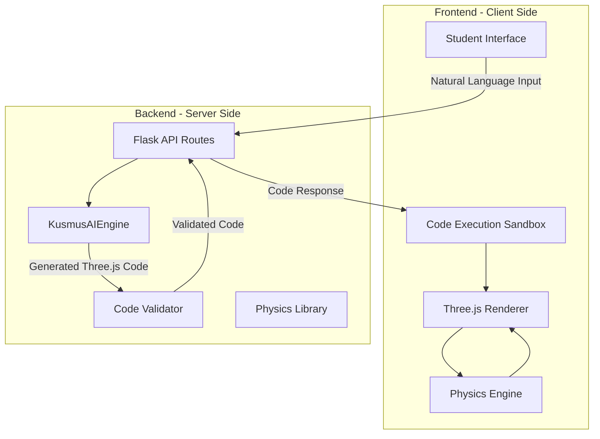
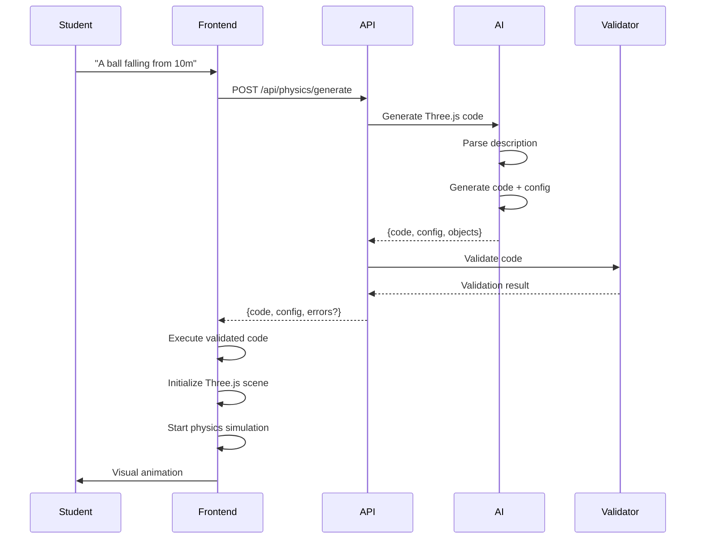

# Physics Sandbox Architecture Plan

## Executive Summary

This document outlines the architecture for a **Physics Practical Sandbox** that allows students to describe physics experiments in natural language, which are then visualized in real-time using Three.js with AI-generated code.

**Viability Assessment:**
- ✅ **Real-time visualization**: Fully viable with Three.js and modern browsers
- ✅ **AI-generated code approach**: Viable with proper prompt engineering and security measures
- ✅ **Integration with existing codebase**: Leverages existing `sandbox` module and `KusmusAIEngine`

---

## 1. System Architecture Overview



---

## 2. Component Details

### 2.1 Frontend Components

#### A. Student Interface (`templates/physics_sandbox.html`)
- **Natural Language Input**: Text area for describing experiments
- **Visualization Canvas**: Three.js rendering area (reusing existing `#canvas-container`)
- **Dynamic Controls Panel**: Sliders and input fields to adjust experiment variables in real-time
  - **Global Parameters**: Gravity, time scale, simulation speed
  - **Object Parameters**: Mass, velocity, position, size, friction, restitution
  - **Live Updates**: Changes apply immediately without re-generating code
- **Playback Controls**: Play/Pause/Reset/Step-by-step
- **Code Preview**: Show generated Three.js code (educational)
- **Error Display**: Friendly error messages for invalid experiments

### 2.3 Variable Control System

#### Dynamic Parameter Adjustment
- **Approach**: Expose physics parameters as reactive state
- **Implementation**: Web Components or React-like state management

```javascript
class PhysicsExperiment {
    constructor(config) {
        this.config = config;
        this.physicsWorld = new CANNON.World();
        this.objects = new Map();
        this.listeners = new Set();
    }
    
    // Dynamic parameter update
    updateParameter(objectId, paramName, value) {
        const obj = this.objects.get(objectId);
        if (obj) {
            switch(paramName) {
                case 'mass':
                    obj.body.mass = value;
                    obj.body.updateMassProperties();
                    break;
                case 'velocity':
                    obj.body.velocity.set(...value);
                    break;
                case 'position':
                    obj.body.position.set(...value);
                    break;
                case 'friction':
                    obj.material.friction = value;
                    break;
                case 'restitution':
                    obj.material.restitution = value;
                    break;
            }
            this.notifyListeners('parameterChanged', { objectId, paramName, value });
        }
    }
    
    // Global parameter updates
    updateGlobalParam(paramName, value) {
        switch(paramName) {
            case 'gravity':
                this.physicsWorld.gravity.set(...value);
                break;
            case 'timeScale':
                this.timeScale = value;
                break;
        }
        this.notifyListeners('globalParamChanged', { paramName, value });
    }
    
    addListener(callback) {
        this.listeners.add(callback);
    }
    
    notifyListeners(event, data) {
        this.listeners.forEach(cb => cb(event, data));
    }
}
```

#### UI Components for Variable Control
- **Global Controls Section**:
  - Gravity slider: 1-20 m/s²
  - Time scale: 0.1x - 5x speed
  - Simulation reset button
  
- **Object Controls Section** (auto-generated based on experiment objects):
  - Mass: 0.1 kg - 100 kg
  - Initial velocity: [x, y, z] vector inputs
  - Position: [x, y, z] coordinates
  - Size: scale factor
  - Friction: 0.0 - 1.0
  - Restitution (bounciness): 0.0 - 1.0
  
- **Quick Adjust Panel**:
  - Pre-set values for common scenarios
  - "What if" scenario buttons (e.g., "Double the mass", "Remove friction")
- **Scene Management**: Camera, lighting, background
- **Object Factory**: Pre-built templates for common objects (balls, ramps, pendulums)
- **Animation Loop**: 60fps rendering with physics integration
- **Material Library**: Physics-appropriate materials (friction, elasticity)

#### C. Physics Engine (Client-side)
- **Recommended**: `cannon-es` (lightweight, good performance)
- **Features**:
  - Rigid body dynamics
  - Collision detection
  - Gravity simulation
  - Constraint systems (for pendulums, springs)

#### D. Code Execution Sandbox
- **Function**: Safely execute AI-generated Three.js code
- **Approach**: Use `Function` constructor with restricted scope
- **Security**: Validate against whitelist of allowed operations

### 2.2 Backend Components

#### A. API Routes (`routes/physics_sandbox.py`)

```python
@sandbox_bp.route("/api/physics/generate", methods=["POST"])
def generate_experiment():
    """
    Takes natural language experiment description
    Returns: Generated Three.js code + physics configuration
    """
    pass

@sandbox_bp.route("/api/physics/validate", methods=["POST"])
def validate_code():
    """
    Validates AI-generated code for security and correctness
    """
    pass

@sandbox_bp.route("/api/physics/examples", methods=["GET"])
def get_examples():
    """
    Returns sample experiment prompts for students
    """
    pass
```

#### B. AI Engine (`core/physics_ai.py`)

Extends `KusmusAIEngine` with physics-specific prompting:

```python
class PhysicsAIEngine(KusmusAIEngine):
    """
    Physics-specific AI engine using Gemini 3.0 Flash.
    Falls back to Gemini 2.5 Flash if 3.0 is unavailable.
    """
    
    def __init__(self):
        super().__init__(
            system_instruction=PHYSICS_SYSTEM_PROMPT,
            model_name="gemini-3.0-flash-lite"  # Primary model
        )
    
    def generate_experiment_code(self, description: str) -> dict:
        """
        Converts natural language to Three.js + physics code
        Uses Gemini 3.0 Flash for fast, accurate code generation.
        
        Returns: {
            'threejs_code': str,
            'physics_config': dict,
            'objects': list,
            'errors': list
        }
        """
        pass
```

#### C. Code Validator (`core/validator.py`)
- **Syntax Validation**: Basic JS parsing
- **Security Checks**:
  - No `eval()` or dangerous functions
  - No network requests
  - Resource limits (max objects, max complexity)
  - Whitelist of allowed Three.js methods

---

## 3. AI Prompt Engineering Strategy

### 3.1 System Prompt

```
You are a Physics Lab Assistant powered by **Gemini 3.0 Flash** (or Gemini 2.5 Flash as fallback) that converts natural language experiment 
descriptions into Three.js visualization code.

Your task:
1. Parse the experiment description
2. Identify physics objects (balls, ramps, pendulums, etc.)
3. Extract parameters (mass, velocity, gravity, friction, etc.)
4. Generate valid Three.js code that visualizes the experiment
5. Include realistic physics simulation using cannon-es

Output Format:
```json
{
    "scene_setup": {
        "camera": {"position": [x,y,z], "lookAt": [x,y,z]},
        "lighting": [...],
        "background": "color or texture"
    },
    "objects": [
        {
            "type": "sphere|box|plane|cylinder",
            "params": {"radius": 1, "width": 2, ...},
            "position": [x,y,z],
            "physics": {
                "mass": 1,
                "velocity": [vx, vy, vz],
                "material": {"friction": 0.3, "restitution": 0.7}
            }
        }
    ],
    "simulation": {
        "gravity": [0, -9.81, 0],
        "timeScale": 1.0,
        "steps": 60
    },
    "code": "```javascript\n// Complete Three.js code here\n```"
}
```

Constraints:
- Use only Three.js r128+ syntax
- Use cannon-es for physics
- Maximum 10 physics objects per scene
- Include proper cleanup function
- No external dependencies beyond Three.js and cannon-es
```

### 3.2 Example Experiment Descriptions

**Simple:**
- "A ball falling from height of 10 meters with gravity"
- "Two balls colliding head-on with equal mass"

**Complex:**
- "A pendulum with length 2m, mass 1kg, released from 45 degrees"
- "A projectile launched at 30 degrees with initial velocity 20 m/s"
- "A ball rolling down a frictionless inclined plane"

---

## 4. Supported Experiment Types

### Phase 1: Simple Experiments (MVP)
| Experiment Type | Physics Concepts | Objects |
|-----------------|------------------|---------|
| Free Fall | Gravity, acceleration | Sphere, ground |
| Projectile Motion | Velocity vectors, gravity | Sphere, trajectory line |
| Simple Pendulum | Periodic motion, gravity | Sphere, constraint |
| Elastic Collision | Momentum, energy conservation | 2+ spheres |
| Inclined Plane | Friction, gravity components | Box, plane |

### Phase 2: Intermediate Experiments
| Experiment Type | Physics Concepts | Objects |
|-----------------|------------------|---------|
| Spring-Mass System | Hooke's law, oscillation | Sphere, spring constraint |
| Wave Propagation | Wave mechanics, interference | Multiple particles |
| Doppler Effect | Sound waves, frequency | Moving source, observer |
| Orbital Motion | Gravity, centripetal force | Multiple bodies |

### Phase 3: Advanced Experiments (Future)
| Experiment Type | Physics Concepts | Objects |
|-----------------|------------------|---------|
| Relativity Visualization | Time dilation, length contraction | Special effects |
| Quantum Probability | Wave functions, probability density | Particle systems |
| Electromagnetic Fields | Field lines, Lorentz force | Field visualizations |

---

## 5. Data Flow



---

## 6. Security & Performance Considerations

### 6.1 Code Validation
```python
WHITELISTED_GLOBALS = {
    'THREE', 'Scene', 'PerspectiveCamera', 'WebGLRenderer',
    'SphereGeometry', 'BoxGeometry', 'PlaneGeometry',
    'MeshStandardMaterial', 'Mesh', 'Vector3', 'Color',
    'CANNON', 'World', 'Body', 'Sphere', 'Box',
    'console'  # Allow for debugging
}

BLOCKED_PATTERNS = [
    r'eval\s*\(',
    r'Function\s*\(',
    r'document\.cookie',
    r'fetch\s*\(',
    r'XMLHttpRequest',
    r'location\.href',
    r'import\s*\(',
    r'require\s*\('
]
```

### 6.2 Performance Limits
- **Max Objects**: 10 physics bodies per scene
- **Max Polygons**: 100,000 triangles total
- **Animation Duration**: 30 seconds max per run
- **Memory Limit**: 50MB per experiment

### 6.3 Error Handling
- Invalid descriptions → Suggest corrections
- Timeout errors → Graceful degradation
- Physics errors → Reset to initial state
- Render errors → Fallback to wireframe mode

---

## 7. API Endpoint Specifications

### POST `/api/physics/generate`

**Request:**
```json
{
    "description": "A ball falling from 10 meters",
    "complexity": "simple",  // simple, intermediate, advanced
    "options": {
        "show_code": true,
        "show_controls": true
    }
}
```

**Response:**
```json
{
    "success": true,
    "experiment": {
        "title": "Free Fall Experiment",
        "description": "Ball falling under gravity",
        "threejs_code": "...",
        "physics_config": {
            "gravity": [0, -9.81, 0],
            "objects": [...]
        },
        "estimated_runtime": 5000
    },
    "preview_url": "/api/physics/preview/abc123"
}
```

### GET `/api/physics/examples`

**Response:**
```json
{
    "simple": [
        {"prompt": "A ball dropped from rest", "concept": "Free Fall"},
        {"prompt": "Two balls colliding", "concept": "Elastic Collision"}
    ],
    "intermediate": [
        {"prompt": "A pendulum swinging", "concept": "Simple Harmonic Motion"},
        {"prompt": "A spring bouncing", "concept": "Hooke's Law"}
    ]
}
```

---

## 8. Integration with Existing Codebase

### 8.1 Reuse Existing Components
- **Session Management**: Use existing `session` handling
- **AI Engine**: Extend `KusmusAIEngine` for physics
- **Three.js**: Already loaded in `sandbox.html`
- **Styling**: Reuse existing glassmorphism UI

### 8.2 New Files Required
```
routes/physics_sandbox.py     # New API routes
core/physics_ai.py            # Physics-specific AI prompts
core/validator.py             # Code validation logic
core/physics_engine.py        # Physics simulation utilities
templates/physics_sandbox.html # New template
static/js/physics_renderer.js # Three.js + Cannon-es integration
static/css/physics_sandbox.css # Component styles
```

---

## 9. Implementation Roadmap

### Phase 1: Foundation (Week 1)
- [ ] Create `routes/physics_sandbox.py` with basic endpoints
- [ ] Implement AI prompt engineering for simple experiments
- [ ] Create `templates/physics_sandbox.html`
- [ ] Integrate Three.js and Cannon-es
- [ ] Build object factory for basic shapes

### Phase 2: Core Features (Week 2)
- [ ] Implement AI code generation
- [ ] Add code validation
- [ ] Support 5 simple experiment types
- [ ] Add playback controls (play/pause/reset)
- [ ] Implement error handling

### Phase 3: Enhancement (Week 3)
- [ ] Add intermediate experiments
- [ ] Implement parameter sliders
- [ ] Add trajectory visualization
- [ ] Support experiment saving/loading
- [ ] Add educational hints

### Phase 4: Advanced Features (Week 4)
- [ ] Complex experiment support
- [ ] Multiple camera views
- [ ] Data export (CSV for analysis)
- [ ] Collaboration features
- [ ] Performance optimization

---

## 10. Viability Assessment Summary

### Is this solution viable for real-time visualization?

**YES** - Here's why:

1. **Performance**: Modern browsers can handle 60fps physics simulations with Three.js
2. **AI Capability**: Gemini 2.5 Flash can generate valid Three.js code reliably
3. **Existing Infrastructure**: Leverages your proven sandbox architecture
4. **Scalability**: Client-side physics reduces server load

### Should you use AI for this?

**YES** - Advantages:
- **Natural Language**: Students can experiment freely without coding knowledge
- **Adaptability**: AI can handle varied experiment descriptions
- **Learning Opportunity**: Students can see generated code and learn

**Considerations**:
- Add fallback templates for common experiments
- Implement robust validation (security is critical)
- Cache generated experiments to reduce API calls

---

## 11. Next Steps

1. ✅ **Architecture Plan**: This document
2. [ ] **Prototype**: Build minimal viable version with 2-3 experiments
3. [ ] **User Testing**: Get feedback from students
4. [ ] **Iterate**: Refine based on real usage
5. [ ] **Scale**: Add more experiment types

---

**Plan Created**: 2026-01-29
**Status**: Ready for Review
